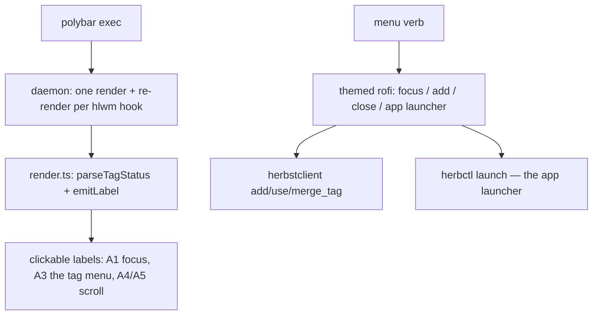
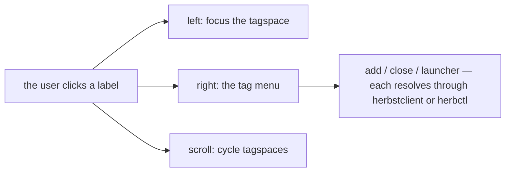

# polytags — structural + logical

## structural

```mermaid
graph TD
    POLYBAR[polybar exec] --> DAEMON[daemon: one render + re-render per hlwm hook]
    DAEMON --> RENDER[render.ts: parseTagStatus + emitLabel]
    RENDER --> LBL[clickable labels: A1 focus, A3 the tag menu, A4/A5 scroll]
    A3[menu verb] --> ROFI[themed rofi: focus / add / close / app launcher]
    ROFI --> HC[herbstclient add/use/merge_tag]
    ROFI --> LAUNCH[herbctl launch — the app launcher]
```

## logical

```mermaid
flowchart LR
    U[the user clicks a label] --> F[left: focus the tagspace]
    U --> R[right: the tag menu]
    R --> A[add / close / launcher — each resolves through herbstclient or herbctl]
    U --> S[scroll: cycle tagspaces]
```
